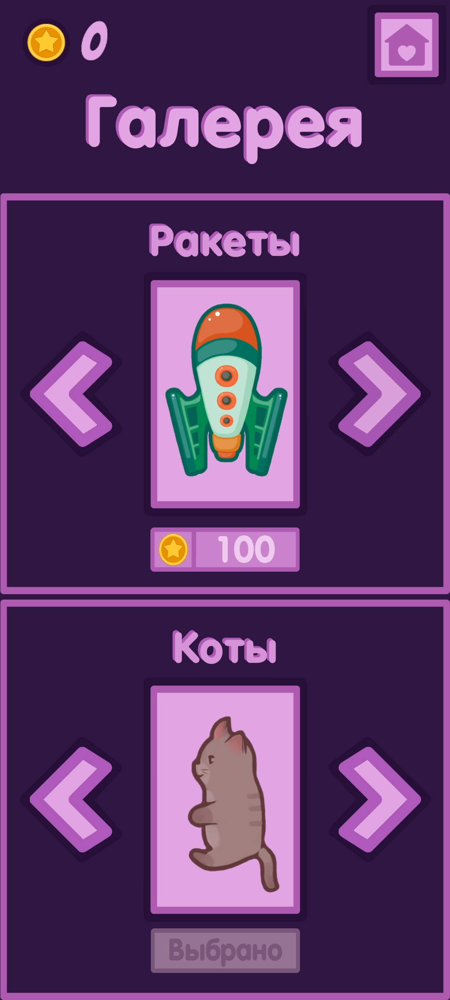

<b>Тип проекта:</b> Мобильный 2D раннер с сюжетной составляющей.

<b>Краткое описание:</b> Вам предстоит отправиться в увлекательное космическое путешествие, чтобы помочь пушистым астронавтам закончить мост, соединяющий галактики.
<h2 align="center">Игровой процесс</h2>
<ul>
<li><b>Перемещение котика</b> осуществляется путём свайпов влево или вправо.</li>
<li> Уклоняйтесь от препятствий, передвигаясь по трём полосам.</li>
<li> Собирайте бустеры: магнит, щит или замедление.</li>
<li> Копите монеты и открывайте новые скины для котика и ракеты.</li>
</ul>
<h2 align="center">Скриншоты игры</h2>
<h3>Главное меню</h3>

<h3>Выбор котика и ракеты для него</h3>

<h3>Страница комикса</h3>

<h3>Игровой процесс</h3>

